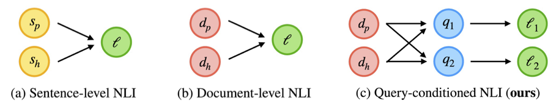

# Query-conditioned Natural Language Inference

This repository contains the dataset and code for the paper "Benchmarking Query-conditioned Natural Language Inference" (Canby et al., 2025).

<div align="center">
  
  <br>
  <em><b>Natural language inference (NLI).</b> (a) Sentence-level NLI has a label $$\ell$$ indicating the semantic relationship between a premise sentence $s_p$ and hypothesis sentence $s_h$. (b) Document-level NLI conditions $\ell$ on a premise \textit{document} $d_p$ and a hypothesis document $d_h$. (c) Query-conditioned NLI conditions label $\ell _i$ on premise document $d_p$, hypothesis document $d_h$, and a \textit{query} $q_i$, which indicates the aspect of the documents the semantic relationship should be based on.</em>
</div>


## Table of Contents
- [Environment Setup](#environment-setup)
- [Dataset](#dataset)
- [Usage](#usage)
  - [Running QC-NLI Task](#running-qc-nli-task)
  - [Converting Datasets to QC-NLI Format](#converting-datasets-to-qc-nli-format)
  - [Adding New Datasets](#adding-new-datasets)
- [Citation](#citation)
- [Security](#security)
- [Contact](#contact)


## Environment Setup

### Prerequisites
- Python 3.8+
- Required API keys (OpenAI, Google AI)

### Installation

1. Clone this repository:
```bash
git clone https://github.com/amazon-science/Query-Conditioned-NLI.git
cd Query-Conditioned-NLI
```

2. Create and activate a virtual environment:
```bash
python -m venv venv
source venv/bin/activate  # On Windows: venv\Scripts\activate
```

3. Install required packages:
```bash
pip install -r requirements.txt
```

4. Set up API keys:
```bash
export OPENAI_API_KEY="your-openai-key"
export GOOGLE_API_KEY="your-google-key"
```

## Dataset

The QC-NLI dataset is located in the `data/` folder and includes adaptations from four existing datasets:

| Dataset                      | Task                            | Size   | Label Set                            |
|------------------------------|---------------------------------|--------|--------------------------------------|
| SNLI (Bowman et al., 2015)   | Image descriptions              | 4,452  | `entailment`, `not_entailment`       |
| RobustQA (Han et al., 2023)  | Inconsistent document detection | 2,578  | `contradiction`, `not_contradiction` |
| RAGTruth (Niu et al., 2024)  | Hallucination detection         | 829    | `entailment`, `not_entailment`       |
| FactScore (Min et al., 2023) | Fact verification               | 13,796 |  `entailment`, `not_entailment`      |


## Usage

### Running QC-NLI Task

Use `src/perform_task.py` to evaluate models on QC-NLI data:

```bash
python src/perform_task.py \
  --dataset robustqa \
  --prompt-type zero \
  --do-merge True \
  --use-query True \
  --start-num 0 \
  --model gpro
```

**Parameters:**
- `--dataset`: Dataset to use
  - Options: `snli`, `ragtruth`, `robustqa`, `factscore_chatgpt`, `factscore_instructgpt`, `factscore_perplexityai`
- `--prompt-type`: Prompting strategy
  - `zero`: Zero-shot prompting
  - `few`: Few-shot prompting  
  - `qanli`: QA+NLI (question-answering followed by NLI)
- `--do-merge`: Merge `neutral` and `contradiction` into `not_entailment` (set to `True` for experiments in paper)
- `--use-query`: Include query in inference (`True`/`False`)
- `--start-num`: Starting index in dataset (typically `0`)
- `--model`: Model to use
  - `gpt`: GPT-4o
  - `gpt3`: GPT-3.5-turbo-0125
  - `gpt4`: GPT-4-0613
  - `gflash`: Gemini 1.5 Flash
  - `gpro`: Gemini 1.5 Pro

### Converting Datasets to QC-NLI Format

Use `src/perform_generations.py` to convert existing datasets into QC-NLI format:

```bash
python src/perform_generations.py \
  --dataset snli \
  --partition train \
  --start-num 0 \
  --model gpt
```

**Parameters:**
- `--dataset`: Source dataset
  - Options: `snli`, `ragtruth`, `robustqa`, `factscore`
- `--partition`: Data partition to convert (valid partitions depend on dataset)
  - SNLI: `train`, `val`, `test`
  - RobustQA: `all`
  - RagTruth: `train`, `test`
  - Factscore: `chatgpt`, `instructgpt`, `perplexityai`
- `--start-num`: Starting index in dataset (typically `0`)
- `--model`: Model for generation (same options as above)

### Adding New Datasets

To adapt a new dataset to QC-NLI format:

1. Create a class extending `ExampleGenerator` in `src/generator.py`
2. Implement the required methods:
   - `read_data(self)`: Load your dataset
   - `generate(self, idx)`: Convert the `idx`th data example to QC-NLI format

Example structure:
```python
class YourDatasetGenerator(ExampleGenerator):
    def __init__(self, **kwargs):
        self.dname = 'your-dataset-name'
        super().__init__(**kwargs)
    
    def read_data(self):
        # Load your dataset
        pass
    
    def generate(self, idx):
        # Convert to QC-NLI format
        pass
```

## Citation

*Coming soon!*

## License

This library is licensed under the CC-By-4.0 License.

## Security

See [CONTRIBUTING](CONTRIBUTING.md#security-issue-notifications) for more information.

## Contact

For questions or issues, please contact `marc.canby@gmail.com` or open an issue on GitHub.
